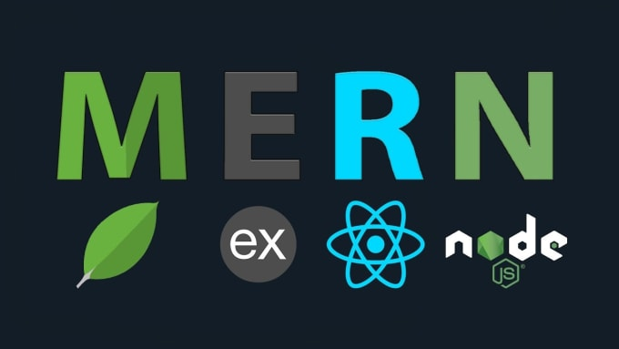
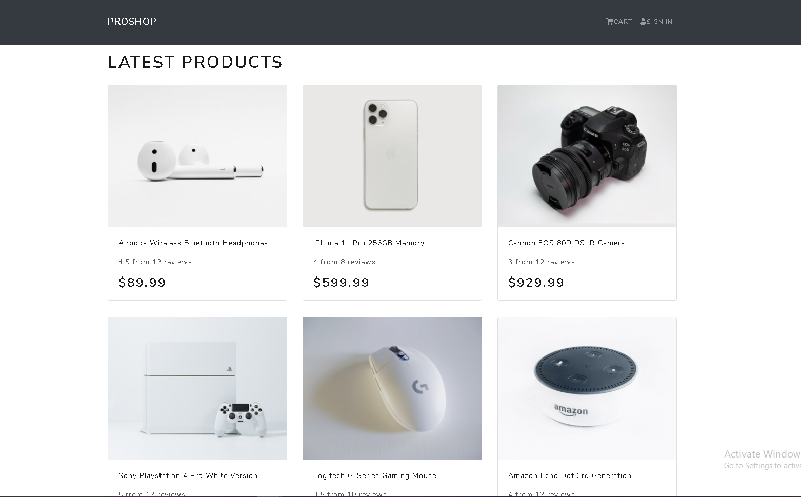
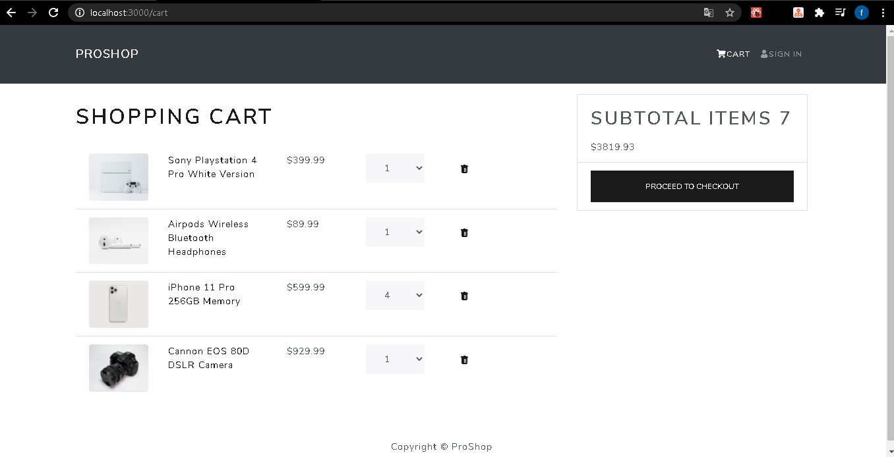

<p align="center">
  
</p>


# ProShop

Aplicação de um e-commerce utilizando a stack MERN (Mongo, Express, React e Node) integrando o método de pagamento do paypal.
Deploy da aplicação feita no heroku.

[PROSHOP](https://proshop43.herokuapp.com/)

Principais bibliotecas utilizadas:

- [x] React-bootstrap
- [x] Typescript
- [x] React router dom
- [x] React router bootstrap
- [x] Axios
- [x] Express
- [x] Concurrently
- [x] Ts node dev
- [x] Mongoose
- [x] Colorts
- [x] Redux
- [x] Jason Web Token
- [x] Jest
- [x] Handlebars
- [x] Sendgrid
- [x] BCrypt
- [x] dotenv
- [x] cloudinary

## Em desenvolvimento

### Front-end:

- [x] Cart
- [x] Routes
- [x] Login
- [x] Logout
- [x] Registrar usuarios
- [x] Editar perfil de usuario
- [x] Perfil de usuários
- [x] Listar pedidos no perfil de usuário
- [x] Deletar usuário (admin)
- [x] Editar usuário (admin)
- [x] Criar produtos (admin)
- [x] Deletar produtos (admin)
- [x] Editar produtos (admin)
- [x] Listagem de produtos
- [x] Review de produtos
- [x] Registrar endereço do usuario
- [x] Editar endereço do usuario
- [x] Tela de Pedidos
- [x] Marcar pedido como entregue (admin)
- [x] Tela de pagamento

### Back-end:

- [x] Connection to Database
- [x] Seeders
- [x] Controllers
- [x] Models
- [x] Error Middleware
- [x] Authentication Middleware
- [x] Admin Middleware
- [x] Routes
- [ ] Services
- [ ] Testing

#### Models

- [x] Order
- [x] Product
- [x] Review
- [x] User
- [x] Shipping Address
- [x] User Token

#### Routes

##### Products

- [x] GET `/api/products` retornar todos os produtos (public)
- [x] GET `/api/products/:id` retornar um produto pelo id (public)
- [x] GET `/api/products/top` retornar produtos com o maior rating (public)
- [x] PUT `/api/products/:id` editar produtos (admin)
- [x] POST `/api/products` criar produtos (admin)
- [x] POST `/api/products/:id/reviews` criar review em um produto (public)
- [x] DELETE `/api/products/:id` deletar produtos (admin)

##### User

- [x] POST `/api/users/login` Login a user (public)
- [x] GET `/api/users/profile` Get logged in user info (private)
- [x] GET `/api/users` Register a user (public)
- [x] PUT `/api/users/profile` update a user (private)

##### Shipping Address

- [x] POST `/api/address` Create a shipping address (private)
- [x] GET `/api/address` Get shipping address info (private)
- [x] PUT `/api/address` update a shipping address (private)

<!-- Caso deseje rodar na sua máquina, digite:

```
git clone https://github.com/Matheus-SS/PROSHOP.git
``` -->

<!-- Instale todas a dependencias tanto da pasta frontend como backend e na pasta raiz chamada, PROSHOP, digite `yarn dev` que irá rodar tanto o backend e frontend ao mesmo tempo. -->

<p align="center">
  
  
  
</p>
